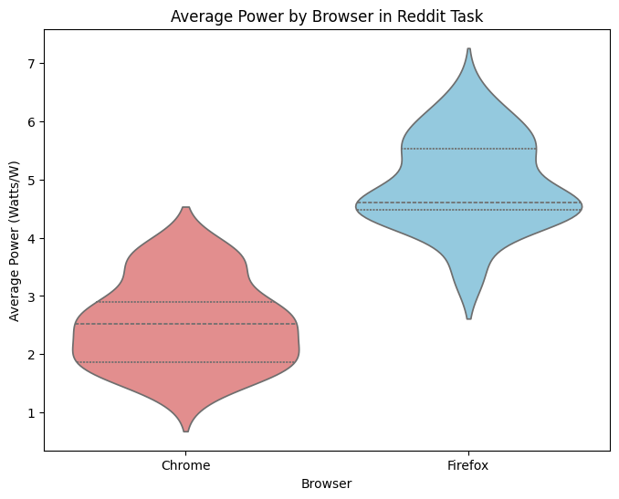
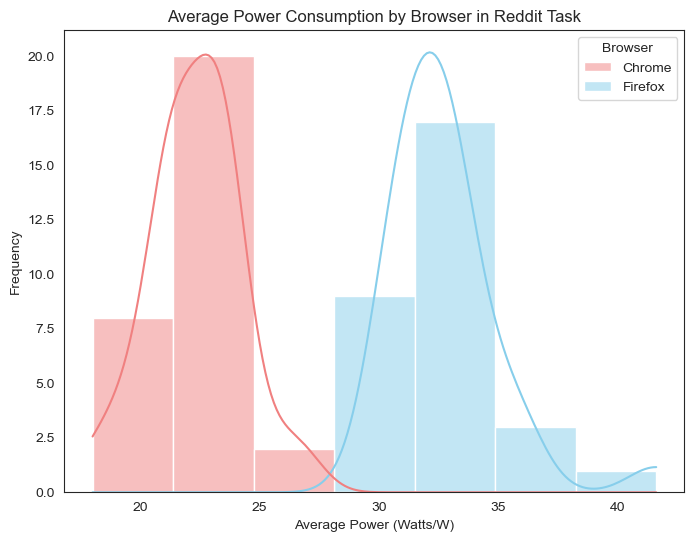

+ **Add your name here**
+ **Change the summary**
+ **Contrive a new title of the blog**
+ **Find a good cover(generate one using diffusion by giving the summary?)**

# Group 4 - The browser energy efficiency revolution: An empirical study of energy consumption from the perspective of user behavior


When 3.7 billion browser users scroll through social media feeds, watch videos, or browse the web, they’re often unaware of the hidden energy consumption differences quietly shaping the digital world’s carbon footprint. These differences might seem small on an individual level, but when scaled across billions of users, they add up to significant environmental impacts.

In this study, we set out to uncover the energy efficiency of everyday web browsing by using an automated testing framework. For the first time, we modeled real user behaviors—like watching YouTube videos and scrolling through Reddit—to measure how much energy popular browsers consume. We compared Firefox 121 and Chrome 122 across three operating systems: MacOS 15.3.1, Fedora, and Windows 11. Using advanced system-level energy isolation techniques, we ensured our measurements were precise and reflective of real-world usage.

Our research aimed to answer critical questions: Is there a meaningful difference in energy efficiency between browsers? How do user behaviors amplify these differences? And can switching browsers or operating systems lead to scalable energy savings? These questions aren’t just technical—they have real-world implications for users, organizations, and the planet

To make these findings actionable, we analyzed user statistics to understand how many people use Firefox across different operating systems. By calculating the potential energy savings of browser migration strategies, we provide practical insights for individuals and organizations looking to reduce their environmental impact.

Our testing methodology focused on two of the most widely used browsers: Google Chrome, known for its speed and feature-rich experience, and Mozilla Firefox, which prioritizes privacy and customization. We used a specialized tool called Energibridge to measure energy consumption during common tasks, ensuring our data was both accurate and relevant to real-world usage.

To capture the full picture, we designed user-centric test scenarios that mimic everyday activities, like streaming videos and browsing content-heavy websites. These scenarios go beyond technical benchmarks, offering practical insights into how small choices—like which browser to use—can have a big impact on energy consumption.
## Table of Contents


# Introduction


When 3.7 billion browser users scroll through social media feeds, hidden energy consumption differences quietly alter the digital world's carbon footprint. This study, through an automated testing framework, achieves the following for the first time:

1. **Modeling Real User Behavior** (YouTube watching, Reddit browsing)
2. **Cross-Browser Energy Benchmarking** (Firefox 121 vs. Chrome 122)
3. **System-Level Energy Isolation Measurement Techniques** (MacOS15.3.1, Fedora, Windows11)
4. **Statistical Significance Validation**

## Research Questions

- Is there a statistically significant difference in energy efficiency between different browsers in typical user scenarios? 
- How do user behavior patterns amplify the energy impact of browser choice?
- Does the energy-saving benefit of browser/operating system migration strategies have scalable application value?

## Key Findings:

**TODO: Change this to the actual data**

Our experiments reveal that, in typical usage scenarios, **Chrome consumes xxxx less energy on average compared to Firefox**, leading to an annual CO₂ reduction of **xxxx per user**. 

If **xxxx of global Firefox users switched to Chrome**, the estimated annual energy savings would reach **xxxx million kWh**—enough to power **xxx households for an entire year**.


-------------------------------------------------------------------------------------------------------------------------------------------------------

# Assessing Real-World Impact

To make our findings more relevant, we will investigate user statistics to understand the number of Firefox users across different operating systems. By calculating potential energy savings based on the average energy consumption difference between the two browsers, we can provide actionable insights for users and organizations alike.

In our testing, we will focus on several software applications that are commonly used by individuals and organizations. The primary tools under test will include:

+ **Google Chrome**: A widely used web browser known for its speed and extensive feature set.

+ **Mozilla Firefox** : An open-source browser that emphasizes privacy and customization.

We will utilize the **Energibridge** tool for measuring energy consumption during our tests. This tool allows us to capture detailed energy usage data while running various browser tasks. By employing this software, we can ensure that our measurements are accurate and reflective of real-world usage scenarios.


# User-Centric Test Scenarios

To ensure our tests accurately represent real-world browser usage, we design **user-centric scenarios** that capture typical activities. This approach provides practical insights into energy consumption beyond purely technical measurements.

## Test Protocol

- **Baseline Task:** 60-second idle period. [Implementation here](https://github.com/D4vidHuang/SSE_EnergyMeasurement/blob/linux_test/linux_scripts/auto_sleep_script.sh)
- **Iterations:** 30 runs, **2 minutes per iteration** (60 seconds active, 60 seconds idle). [Implementation here](https://github.com/D4vidHuang/SSE_EnergyMeasurement/blob/linux_test/linux_scripts/auto_script.sh)  
- **Test Cases:**
  1. **Video Streaming (YouTube):** Measure energy usage during continuous video playback.  

    ```Python
    def play_youtube_video(duration_seconds=60):
        driver = webdriver.Firefox()  # Ensure geckodriver is in PATH

        try:
            driver.get("https://www.youtube.com/watch?v=dQw4w9WgXcQ")
            wait = WebDriverWait(driver, 5)
            try:
                accept_all_button = wait.until(EC.element_to_be_clickable((By.XPATH, "//button[.//span[contains(text(), 'Accept all')]]")))
                accept_all_button.click()
                time.sleep(5)
            except TimeoutException:
                print("Accept all not found")
            try:
                play_button = wait.until(EC.element_to_be_clickable((By.XPATH, "//button[contains(@class, 'ytp-large-play-button')]")))
                play_button.click()
                print("Clicked Play button.")
            except:
                print("Play button not found or already playing.")
            time.sleep(duration_seconds)
        
        finally:
            driver.quit()
    ```

  2. **Social Media Browsing (Reddit):** Assess energy consumption while scrolling and interacting with content.  

    ```python
      def browse_reddit(duration_seconds=60):
      driver = webdriver.Firefox()  # geckodriver is assumed to be in PATH

      try:
          driver.get("https://www.reddit.com")

          time.sleep(5)  # Initial wait

          start_time = time.time()
          while time.time() - start_time < duration_seconds:
              driver.execute_script("window.scrollTo(0, document.body.scrollHeight);")
              time.sleep(2)  # Wait briefly between scrolls

      finally:
          driver.quit()
    ```

## Testing Configuration

### Software Versions

| Component        | Version       |
|-----------------|--------------|
| Google Chrome   | 133.0.6943.99 |
| Mozilla Firefox | 135.0         |
| Energibridge    | v0.0.7        |

### Test Environment

#### Linux
Machine: ASUS Zenbook 14 UX3405MA

  + Processor: Intel® Core™ Ultra 9 185H × 22
  + Memory: 32.0 GiB

Operating System: Fedora Linux 41 (Workstation Edition)

  + Kernel Version: Linux 6.12.15-200.fc41.x86_64
  + Windowing System: Wayland

#### MacOS

**Note:** _TODO: Specify System completely_

#### Windows  
**Machine:** Personal PC  
  - **Processor:** Intel® Core™ i9-12900K  
  - **Memory:** 32.0 GiB  

**Operating System:** Windows 11 Professional  
  - **Version:** 23H2 (Build 22631.4890)  

 

### Experimental Controls

#### **Zen Mode (Minimized System Interference)**  
To ensure consistency, we reduce system background activity as follows:  

- Close all non-essential applications.  
- Disable notifications.  
- Disconnect unnecessary peripherals (USB drives, external displays, etc.).  
- Stop background services (e.g., web servers, file-sharing tools).  
- Disable network connectivity if not required.  
- Prefer wired connections over wireless for stability.  

#### **Configuration Freezing (Eliminating Variability)**  
To maintain test consistency, we **fix and document** key settings:  

- **Display Configuration:** Lock brightness and resolution to a fixed value.  
- **Power Management:** Disable automatic brightness adjustment and dynamic power-saving features.  
- **Network Conditions:** Ensure stable network settings to prevent fluctuations in energy usage.  

By enforcing strict experimental controls, we **minimize variability** and ensure the reproducibility of our results.


# Statistical Significance Testing Formulas

## T-Statistic
The T-Statistic measures the significance of the difference between the means of two samples. It is calculated as:

$$
t = \frac{\bar{X}_1 - \bar{X}_2}{\sqrt{\frac{s_1^2}{n_1} + \frac{s_2^2}{n_2}}}
$$

where:
- $\bar{X}_1$, $\bar{X}_2$ are the means of the two samples,
- $s_1^2$, $s_2^2$ are the variances of the two samples,
- $n_1$, $n_2$ are the sizes of the two samples.

---

## P-Value
The P-Value represents the probability of observing the current or a more extreme test statistic under the null hypothesis. For a two-sample t-test, it is given by:

$$
p = 2 \cdot \text{CDF}_t(-|t|; \text{df})
$$

where:
- $\text{CDF}_t$ is the cumulative distribution function of the t-distribution,
- $|t|$ is the absolute value of the t-statistic,
- $\text{df}$ is the degrees of freedom, calculated as:

$$
\text{df} = \frac{\left(\frac{s_1^2}{n_1} + \frac{s_2^2}{n_2}\right)^2}{\frac{(s_1^2/n_1)^2}{n_1-1} + \frac{(s_2^2/n_2)^2}{n_2-1}}
$$

---

### Significance Criterion
- If $p < \alpha$ (typically $\alpha = 0.05$), reject the null hypothesis, indicating a significant difference between the two sample means.
- If $p \geq \alpha$, there is insufficient evidence to reject the null hypothesis.


# Testing Results


## MacOS

This section summarizes the **macOS** test outcomes for **Chrome** and **Firefox** under two common usage scenarios: **Reddit browsing** and **YouTube video playback**. All values have been baseline-corrected using an average sleep energy measurement of **240.68 Joules**, following outlier removal.

- **Figure 1**:   
- **Figure 2**:   
- **Figure 3**: 
- **Figure 4**: 

---

### Reddit Browsing Task

**Baseline Average Energy (post-outlier removal):** 240.68 Joules

**Data Cleaning:**
- Excluded one negative outlier (Iteration 59: -0.065 Joules).

**Statistical Analysis:**
- **t-statistic:** 12.43  
- **p-value:** 7.20e-18  

**Interpretation:**
- As shown in Figures 1 and 3, Chrome exhibits significantly lower average energy consumption than Firefox for the Reddit browsing task.  
- The p-value (7.20e-18) indicates that the observed difference is extremely unlikely to be due to random variation, suggesting a high level of statistical significance.

---

### YouTube Playback Task

**Baseline Average Energy (post-outlier removal):** 240.68 Joules

**Data Cleaning:**
- No negative outliers were detected.

**Statistical Analysis:**
- **t-statistic:** 1.26  
- **p-value:** 0.211  

**Interpretation:**
- As shown in Figures 2 and 4, the average energy consumption of Chrome and Firefox is quite similar for YouTube playback.  
- The p-value (0.211) suggests that there is no statistically significant difference between the two browsers, making it difficult to conclude which one is more efficient in this scenario.

---

## Windows

This section summarizes the **Windows** test outcomes for **Chrome** and **Firefox** under two common usage scenarios: **Reddit browsing** and **YouTube video playback**. All values have been baseline-corrected using an average sleep energy measurement of **455.0382 Joules**, following outlier removal.

- **Figure 1**:   
- **Figure 2**:   

---

### Reddit Browsing Task
- **Figure 3**:   
- **Baseline Average Energy (post-outlier removal):** 455.0382 Joules  
- **Data Cleaning:** No negative outliers were detected.  
- **Statistical Analysis:**  
  - **t-statistic:** 19.22  
  - **p-value:** 7.80e-27  

**Interpretation:** As shown in Figures 1 and 3, Chrome demonstrates a statistically significant lower energy consumption for Reddit browsing compared to Firefox. The **p-value (7.80e-27)** confirms that this difference is highly significant and unlikely due to random chance.

From a sustainability perspective, this means that **using Chrome for Reddit browsing could result in measurable energy savings**, reducing power consumption and contributing to a lower environmental footprint. Over time, this could lead to more efficient resource use and lower electricity costs for users.

---

### YouTube Playback Task
- **Figure 4**:   
- **Baseline Average Energy (post-outlier removal):** 455.0382 Joules  
- **Data Cleaning:** No negative outliers were detected.  
- **Statistical Analysis:**  
  - **t-statistic:** -1.88  
  - **p-value:** 0.0652  

**Interpretation:** In Figures 2 and 4, the YouTube playback energy usage for Chrome and Firefox appears more similar. The **p-value (0.0652)** suggests that the difference in average energy consumption is **not statistically significant** at the 0.05 threshold, although it is marginally close.

This indicates that for **YouTube playback, both browsers perform similarly in terms of energy consumption**, meaning there is no clear advantage in choosing one over the other purely for energy efficiency purposes.

---
## Linux
This section summarizes the **Linux** test outcomes for **Chrome** and **Firefox** under two common usage scenarios: **Reddit browsing** and **YouTube video playback**. All values have been baseline-corrected using an average sleep energy measurement of **502.46 Joules**, following outlier removal.

- **Figure 5**:   
- **Figure 6**:   
- **Figure 7**: 
- **Figure 8**: 

---

### Reddit Browsing Task
- **Baseline Average Energy (post-outlier removal):** 502.46 Joules  
- **Data Cleaning:** No negative outliers were detected.  
- **Statistical Analysis:**  
  - **t-statistic:** 10.77  
  - **p-value:** 1.81e-15  

**Interpretation:** As shown in Figures 5 and 7, Chrome demonstrates a statistically significant lower energy consumption for Reddit browsing compared to Firefox. The **p-value (1.81e-15)** strongly suggests that the observed difference is unlikely due to random chance.

### YouTube Playback Task
- **Baseline Average Energy (post-outlier removal):** 502.46 Joules  
- **Data Cleaning:** No negative outliers were detected.  
- **Statistical Analysis:**  
  - **t-statistic:** -0.96  
  - **p-value:** 0.336  

**Interpretation:** In Figures 6 and 8, the YouTube playback energy usage for Chrome and Firefox appears more similar. The **p-value (0.336)** indicates that the difference in average energy consumption between the two browsers is **not** statistically significant in this scenario.

---

## Results Table
### Reddit Scrolling
Average Normalised Power in Watts

|          | Linux         | Windows         | MacOS                      |
|----------|:-------------:|:---------------:|:---------------------------:|
| **Firefox**  | 21.013 | Text is centered | And this is right-aligned  |
| **Chrome**   | 17.553    | Even more text   | And even more to the right |

### Youtube Streaming
Average Normalised Power in Watts

|          | Linux         | Windows         | MacOS                      |
|----------|:-------------:|:---------------:|:---------------------------:|
| **Firefox**  | 16.928 | Text is centered | And this is right-aligned  |
| **Chrome**   | 17.108    | Even more text   | And even more to the right |

# Conclusion

By focusing on user-centric scenarios and emphasizing the real-world impact of our findings, this project aims to provide valuable insights into the energy consumption of web browsers. Through our testing, we hope to encourage users to make informed decisions that contribute to a more sustainable digital environment.

# Limitations
Despite the valuable insights derived from our user-centric energy consumption measurements, this study has certain limitations. We only tested two browsers, Chrome and Firefox, in specific versions, leaving other browsers like Safari, Edge, or older releases unexamined. Our usage scenarios—YouTube playback and Reddit browsing—represent only a fraction of real-world browsing behaviors, which can include gaming, multi-tab usage, and complex web applications. Additionally, the hardware environments for Linux, macOS, and Windows were restricted to specific devices, limiting the broader applicability of our findings. Network conditions, which we attempted to standardize, may also vary greatly in practice and influence energy usage. Lastly, although we minimized background processes, real-world situations often involve concurrent tasks (e.g., antivirus scans, syncing) not fully represented in our controlled tests.

# Future Work
As for future work, expanding the scope of browsers and versions would provide a more comprehensive view of how different rendering engines and optimizations impact energy consumption. More complex user scenarios, including video conferencing, multi-tab workflows, and gaming, could offer richer insights into how browsing choices affect power draw. Longitudinal studies over extended periods would highlight browser performance in routine daily usage, while testing on a wider range of hardware—including older and ARM-based devices—would improve generalizability. Varying network conditions, such as bandwidth and latency, merit further exploration for their potential to affect browser energy efficiency. Finally, continued refinement of automated testing frameworks and tools (like Energibridge) could yield more granular and scalable data, deepening our understanding of how browser behavior influences energy use.
